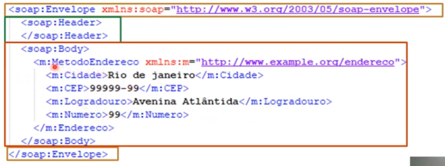

# Vantagens e desenvolvimento de web services

## Serviços web ou Web Services

São soluções de comunicação entre aplicações, independentemente de software ou hardware. Foram originalmente desenvolvidos como troca de mensagem por XML. Em resumo, são API's que se comunucam sobre o protocolo HTTP.

Web services usam linguagens de marcação como XML ou JSON para facilitar o acesso e integração por qualquer linguagem ou sistemas. melhora a reutilização do serviço e a segurança

Entre as principais tecnologias se destacam: SOAP, REST, XML e JSON

**SOAP**

SOAP é a sigla de Simple Access Protocoll. É um protocolo baseado em XML para acessar web services, principalmente via HTTP (mas pode ser usado por outros protocolos como o SFTP, é um protocolo ,portanto, genérico). É uma definição de comunicação entre aplicações.

Estrutura SOAP

- Envelope > encapsula toda a mensagem SOAP. Marca seu inpicio e fim.
- Header > informações sobre atributos e metadados
- Body > atributos e conteúido em si

**XML**

Extensible Markup Language, criado pela w3c na década de 90, é uma linguagem de marcação para transporte de dados agrupados em tags, facilitando a separação de conteúdo.

**WSDL**

Web Service Description Language > funciona como contrato de serviço. A descrição é feita em um documento XML e especifica como o serviço funciona

**XSD**

XML Schema Definition > É um XML  que define a estrutura de dados e atributos obrigatórios que serão validados no XML. É a documentação base de como deve ser montado o SOAP message.

**Ferramenta de Teste - SOAP UI**

Na versão open source dá pra fazer o teste do protocolo SOAP com base no WSDL.

No python temos a biblioteca zeep

## Rest, API e JSON

**REST**

Representationa State Transfer : Trabalha com o estado representacional do objeto na hora de sua chamada. O REST  não é um protocolo. É um design de arquitetura para serviços web que roda sobre HTTP. Pode trabalhar com diverson formatos: XML, JSON, CSV, etc...

Permite a integração de aplicações e entre cliente e servidor. Utiliza métodos HTTP (get, post, put, delete...) para definir o que está sendo efetuado.

**API**

Aplication Programming Interface > Uma aplicação disponibiliza conjuntos de rotinas para outras aplicações consumirem sua funcionalidade. Não precisa necessariamente seguir a arquitetura REST.

**Método HTTP** > todo serviço REST segue essa arquitetura

- get - Solicita a representação de um recurso
- post - Solicita a criação de um recurso
- delete - Solicita a exclusão de um recurso
- put - Solicita atualização de um recurso

**JSON**

Javascript Object Notation > transfere dados, como o xml, mas não usa tags. Usa estrutura chave(ou atributo) e valor. É uma forma leve e popular de transferência de dados.

**Códigos de status HTTP**

Usado pelo servidor para informar o estado da operação solicitada

- 1xx - informativo
- 2xx - sucesso
- 3xx - redirecionamento
- 4xx - erro no cliente
- 5xx - erro no servidor

ver mozill http codes
